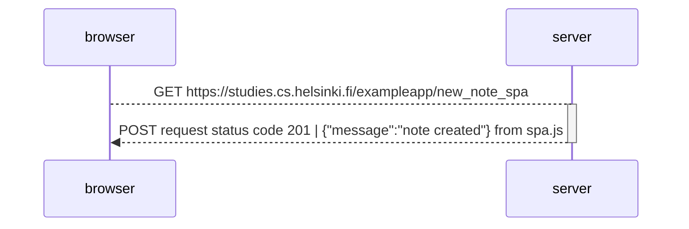

```mermaid
sequenceDiagram;
participant browser
participant server

browser --> server: GET https://studies.cs.helsinki.fi/exampleapp/new_note_spa
activate server
server-->>browser: POST request status code 201 | {"message":"note created"} from spa.js
deactivate server 
```